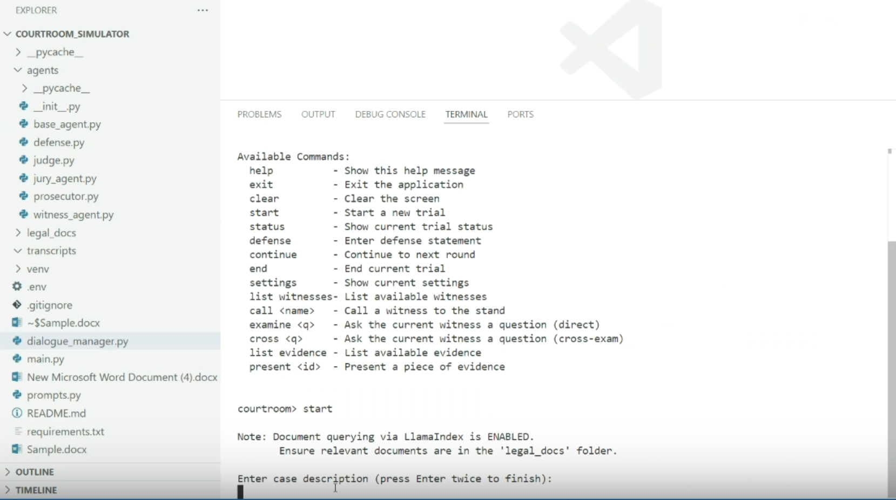

# An interactive AI courtroom simulation powered by multi-agent systems

An interactive AI-powered courtroom simulation application that allows users to participate in simulated legal trials with multiple AI agents acting as judge, prosecutor, jury, and witnesses.

## Demo: AI Courtroom Simulator
This demo shows how CrewAI agents simulate courtroom roles like Judge, Prosecutor, and Witness.

[](https://www.loom.com/share/274944e4a316401db3cc03474addfdb9)


## Features

*   **Interactive Command-Line Interface:** Manage the trial progression through simple commands.
*   **AI-Powered Agents:**
    *   **Judge:** Presides over the trial, provides instructions, rules on objections.
    *   **Prosecutor:** Presents arguments, can object to defense statements.
    *   **Witnesses:** Users can define witnesses with testimony who can be called and questioned.
    *   **Jury:** Listens to the proceedings, receives instructions, and delivers a verdict.
    *   *(Note: Defense agent role is currently handled by the user input via the `defense` command).*
*   **Dynamic Trial Flow:**
    *   Start trials with custom case descriptions.
    *   Add specific witnesses and evidence for each trial.
    *   Call witnesses, conduct direct examination (`examine`), and cross-examination (`cross`).
    *   Present evidence items.
    *   Multi-turn dialogue based on user commands and agent responses.
*   **Document Context (Optional):**
    *   Utilizes LlamaIndex to load and index documents from the `legal_docs/` directory.
    *   If enabled (`USE_LLAMA_INDEX=True` in settings) and documents are present, Judge and Prosecutor agents can query these documents to inform their responses and rulings.
*   **User Performance Evaluation:**
    *   The user's initial case description and subsequent defense statements are evaluated.
    *   Evaluation focuses on **Persuasiveness, Factual Grounding, and Coherence**.
    *   Scores (1-10) and feedback are displayed at the end of the trial.
*   **Transcript Generation:** Saves a detailed JSON transcript of each trial in the `transcripts/` directory upon completion.

## Setup

1.  **Clone the Repository:**
    ```bash
    git clone <repository_url>
    cd courtroom-simulator-ai
    ```

2.  **Create and Activate Virtual Environment:**
    ```bash
    # Windows
    python -m venv venv
    .\venv\Scripts\activate

    # macOS / Linux
    python3 -m venv venv
    source venv/bin/activate
    ```

3.  **Install Dependencies:**
    ```bash
    pip install -r requirements.txt
    ```
    This installs:
    - `crewai` (>=0.11.0) - For agent functionality
    - `openai` (>=1.12.0) - For AI interactions
    - `python-dotenv` (>=1.0.0) - For environment variables
    - `llama-index` (>=0.9.0) - For document indexing

4.  **Configure Environment:**
    *   Create a file named `.env` in the project's root directory.
    *   Add your OpenAI API key:
        ```dotenv
        OPENAI_API_KEY=your_openai_api_key_here
        ```

5.  **Configure Settings (`settings.py`):**
    *   Review `settings.py` for options like `DEFAULT_MODEL` and `MAX_ROUNDS`.
    *   Set `USE_LLAMA_INDEX = True` if you want to enable document querying.

6.  **(Optional) Add Legal Documents:**
    *   If using LlamaIndex, place relevant text files, PDFs, etc., into the `legal_docs/` directory.

## Running the Application

Execute the main script from your terminal:

```bash
python main.py
```

The application will start and present the `courtroom>` prompt.

## Usage (Commands)

Enter the following commands at the `courtroom>` prompt:

*   **`help`**: Show list of commands.
*   **`exit`**: Quit the application.
*   **`clear`**: Clear the terminal screen.
*   **`settings`**: Show current settings.
*   **`status`**: Show current trial status.

*   **`start`**: Start a new trial.
    *   Prompts for case description.
    *   Asks to add witnesses (name and testimony).
    *   Asks to add evidence (ID and description).
    *   Initializes agents and starts the trial.
*   **`continue`**: Process the prosecution's turn.
*   **`defense`**: Enter a defense statement.
*   **`list witnesses`**: List the names of witnesses.
*   **`call <witness_name>`**: Call a witness to the stand.
*   **`examine <question>`**: Ask a question to the current witness.
*   **`cross <question>`**: Cross-examine the current witness.
*   **`list evidence`**: List the evidence items.
*   **`present <evidence_id>`**: Present evidence to the court.
*   **`end`**: End the current trial.

## Project Structure

*   `main.py`: CLI application entry point.
*   `dialogue_manager.py`: Core class managing trial state and agent interactions.
*   `agents/`: Directory containing AI agent implementations.
    *   `__init__.py`: Exports agent classes.
    *   `base_agent.py`: Base agent class.
    *   `judge.py`: Judge agent.
    *   `prosecutor.py`: Prosecutor agent.
    *   `witness_agent.py`: Witness agent.
    *   `jury_agent.py`: Jury agent.
*   `settings.py`: Configuration variables.
*   `prompts.py`: Prompt templates.
*   `requirements.txt`: Project dependencies.
*   `.env`: Environment variables.
*   `legal_docs/`: Directory for documents to be indexed.
    *   Contains legal documents (text files, PDFs) that can be used to inform the AI agents' responses
    *   Documents are indexed using LlamaIndex when `USE_LLAMA_INDEX=True` in settings
    *   Supported formats: .txt, .pdf, .docx, .md
    *   Documents should be relevant to the legal domain (case law, statutes, legal principles)
    *   The Judge and Prosecutor agents can query these documents to provide more informed responses
*   `transcripts/`: Directory for trial transcripts.

## License

MIT License 
